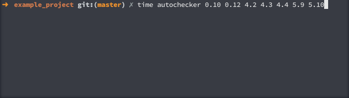

# autochecker

[](https://circleci.com/gh/VictorBjelkholm/autochecker/tree/master)

autochecker tests your libraries in many different versions of NodeJS, Ruby, Java and many other languages.

Created to make it easier and effortless to make sure your library works in many versions of a language runtime.

Works well with CI as well! ([See some example output](https://github.com/VictorBjelkholm/ruby-autochecker-example/))

(Works out of the box with NodeJS projects right now, more in the future!)

<p align="center">
  
</p>

## Requirements

* Docker -> [install here](https://www.docker.com/products/docker-toolbox)
* `package.json` `scripts.test` setup correctly (for NodeJS projects)
* Two environment variables, `DOCKER_HOST` and `DOCKER_CERT_PATH` (comes by default with docker-machine)

`DOCKER_HOST` should look similar to this: `tcp://192.168.99.100:2376`

`DOCKER_CERT_PATH` should look similar to this: `/Users/victor/.docker/machine/machines/default`

## Installation

As always, one step:

* For one project > `npm install autochecker`

* Globally on your computer OR to use with other languages > `npm install -g autochecker`

For extra style points, make sure autochecker is run before publishing your modules:

In `package.json`:

```json
"scripts": {
	"prepublish": "autochecker 0.10 0.12 4.0 5.0"
}
```

## Running NodeJS project out of the box

By default, executing `autochecker` will run the tests on all available versions.

You can specify which versions you want to test by adding them in the end of the command:

`autochecker 0.10 0.11 4 5.10.1`

Versions comes from the `mhart/alpine-node` docker image tags

## Running with other languages

To see how you can run autochecker with a Ruby project + CI integration, please take a look at this repository: https://github.com/VictorBjelkholm/ruby-autochecker-example/

Otherwise, there is a couple of examples of other languages in the [/examples](/examples) directory

## Setting max running tests

By default, autochecker starts as many testing sessions as `os.cpu().length` would return. 

However, you can overwrite this by providing the TEST_LIMIT environment variable.

Example: `TEST_LIMIT=10 autochecker` to run 10 test sessions at a time

## Custom Dockerfile template

You can specify custom Dockerfile template if you need additional tools installed, for
example if you need `git`, create a file in the project `DockerTemplate` with the following

```
FROM mhart/alpine-node:$VERSION
RUN mkdir -p /usr/src/app
WORKDIR /usr/src/app
COPY package.json .
# Adding extra tools
RUN apk add --update git
RUN npm install
COPY . .
CMD npm test
```

Variable `$VERSION` will be replaced by autochecker. More information about alpine images
and additional tools at 
[docker-alpine](https://github.com/gliderlabs/docker-alpine/blob/master/docs/usage.md) and
[alpine-node](https://github.com/mhart/alpine-node).

Aside from adding libraries to the container, the custom template can be useful to avoid running postinstall
hooks. Just use `RUN npm install --ignore-scripts` instead.

## Programmatic API

You can use `autochecker` in your own projects from NodeJS directly.

```javascript
var autochecker = require('autochecker')
const Docker = require('dockerode')
var dockerode_instance = new Docker({socketPath: '/var/run/docker.sock'});
autochecker.runTestForVersion({
  logger: (msg) => { console.log(msg) },
  docker: dockerode_instance,
  version: '1.1.1', // version of project
  name: 'myproject', // name of project
  test_cmd: ['npm', 'test'], // command to run tests with
  image_name: 'app/image:commit', // What the built application image will be called
  path: join(__dirname, 'path_to_project'), // Path to project to build
  dockerfile: 'FROM nodejs:$VERSION', // Dockerfile
  base_image: 'base/image', // Base image, will add :$VERSION to the end
  verbose: false // To show full output or not
})((err, results) => {
  console.log(results)
  // => {version: '1.1.1', success: true || false, output: 'output from test_cmd'}
})
```

See `cli.js` for usage with testing multiple versions at once.

## Changelog

You can find a list of all versions and changes in the [CHANGELOG.md](CHANGELOG.md) file

## License

MIT License 2016 - Victor Bjelkholm
